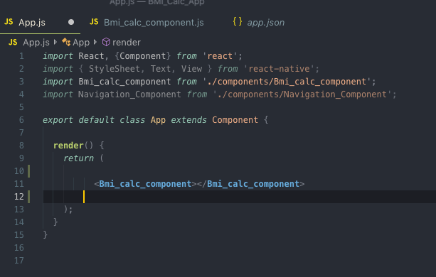
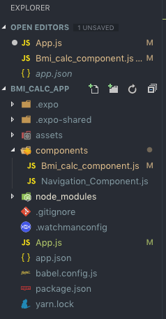

# BMI Calculator - A Simple Mobile Application

<h2 align="center">Here is the app running on a iOS device:</h2>
  

  Since this is coded using React Native, it will work on both a Android and iOS device.
  This functionality is great as it cuts down the time needed to make an app for multiple platforms.
  However, certain native iOS and Android elements cannot be taken advantage of.

  

 
 
 

 <h2 align="center">Here is the main helper function:</h2>
 
 

  After doing some research behind how BMI is calculated, you learn its just a ratio between height and weight. 
  There is no coorelation between age and gender with regards to BMI. Most online and current mobile applications factor this in however, which does not have conclusive data to support it. BMI should be used by medical practitioners as a reference. 

  

 
 
 

<h2 align="center">Component Use and Structure:</h2>
 
 

    Here I am illustrating my understanding on how to break React code into components. This approach is also very similar to how Angular is coded. This allows for reuasibility, as well as a clean code layout when dealing with the main App.js file.
 

  

  

