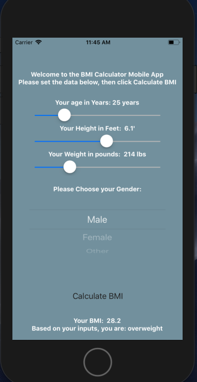
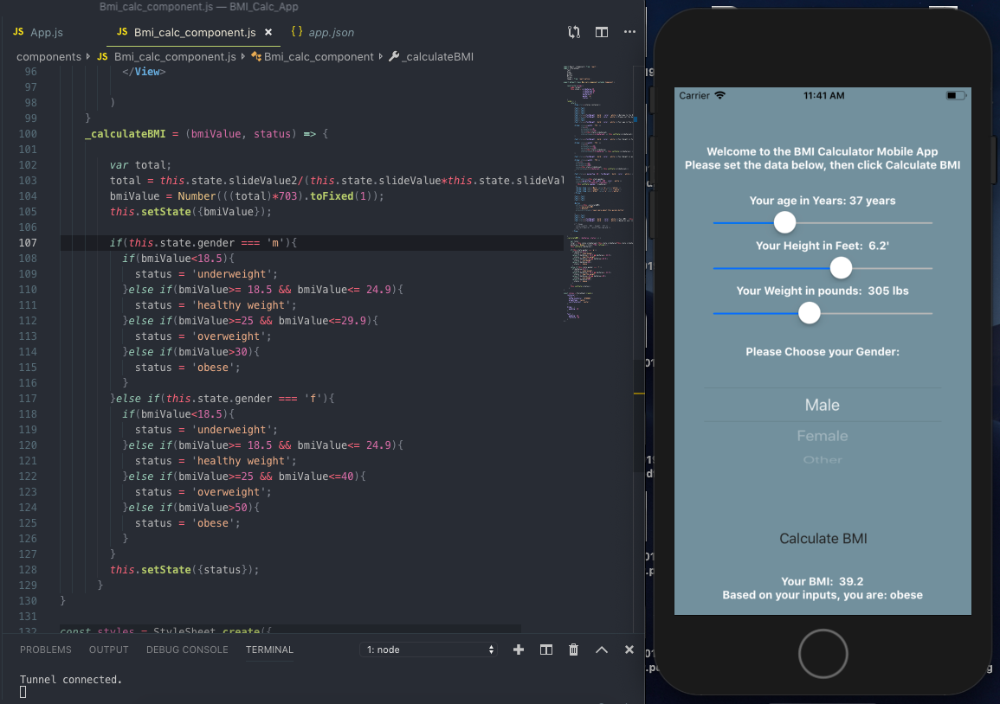

# BMI Calculator - A Simple Mobile Application

  <h2 align="center">Here is the app running on a iOS device:<h2>

  Since this is coded using React Native, it will work on both a Android and iOS device.
  This functionality is great as it cuts down the time needed to make an app for multiple platforms.
  However, certain native iOS and Android elements cannot be taken advantage of.

  

 <h2 align="center">Here is the main helper function:<h2>

  

